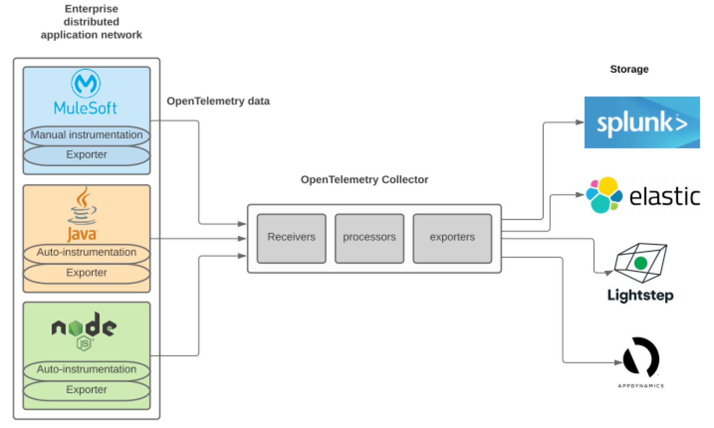

= Mule 4 OpenTelemetry Extension
ifndef::env-github[:icons: font]
ifdef::env-github[]
:caution-caption: :fire:
:important-caption: :exclamation:
:note-caption: :paperclip:
:tip-caption: :bulb:
:warning-caption: :warning:
endif::[]
:toc: macro

toc::[]

== OpenTelemetry

From https://opentelemetry.io[OpenTelemetry.io],

[quote]
OpenTelemetry is a collection of tools, APIs, and SDKs. Use it to instrument, generate, collect, and export telemetry data (metrics, logs, and traces) to help you analyze your software’s performance and behavior.

This *purpose* of this mule extension is to allow Mule Applications participate in OpenTelemetry-based distributed traces.

== Documentation

* https://htmlpreview.github.io/?https://github.com/avioconsulting/mule-opentelemetry-module/blob/main/docs/index.html[HTML Documentation] User reference
** Jump to https://htmlpreview.github.io/?https://github.com/avioconsulting/mule-opentelemetry-module/blob/main/docs/index.html#The-How-Mule-OTel-module-id[Installation and Usage section]
* link:./src/docs/asciidoc/README.adoc[Asciidoc version]

== Testing

=== Local Collector with Zipkin

`src/test/docker` contains two files:

- docker-compose.yml: This config file configures two services -
- OpenTelemetry Collector: https://opentelemetry.io/docs/collector/getting-started/#docker[Collector] service to receive traces.
- OpenZipkin: https://zipkin.io/[Zipkin] as a tracing backend.
- otel-local-config.yml: Collector configuration file. Collector service uses this and forwards traces to zipkin.

=== Local configuration
Following environment variables must be set to send traces to OpenTelemetry collector -

[source,properties]
----
otel.traces.exporter=otlp
otel.exporter.otlp.endpoint=http://localhost:55681/v1
otel.exporter.otlp.traces.endpoint=http://localhost:55681/v1/traces
otel.exporter.otlp.protocol=http/protobuf
otel.metrics.exporter=none
otel.resource.attributes=deployment.environment=dev,service.name=test-api
----

=== Running Example Mule Apps

Import applications from `./examples` directory into Anypoint Studio. Both applications have an OpenTelemetry Configuration to send traces to local docker collector.

Application 1 exposes `http://localhost:8081/app1/{userId}` endpoint for invocation. App 1 calls App 2 over http to simulate distributed tracing.

Anypoint studio caches' the modules used. If you need to modify the extension and test it in imported applications, you need to bump up the version and update example projects with new version.

You may use following command to keep incrementing patch version and install locally -
[source,bash]
----
mvn build-helper:parse-version versions:set -DnewVersion='${parsedVersion.majorVersion}.${parsedVersion.minorVersion}.${parsedVersion.nextIncrementalVersion}' versions:commit && mvn spotless:apply install
----
