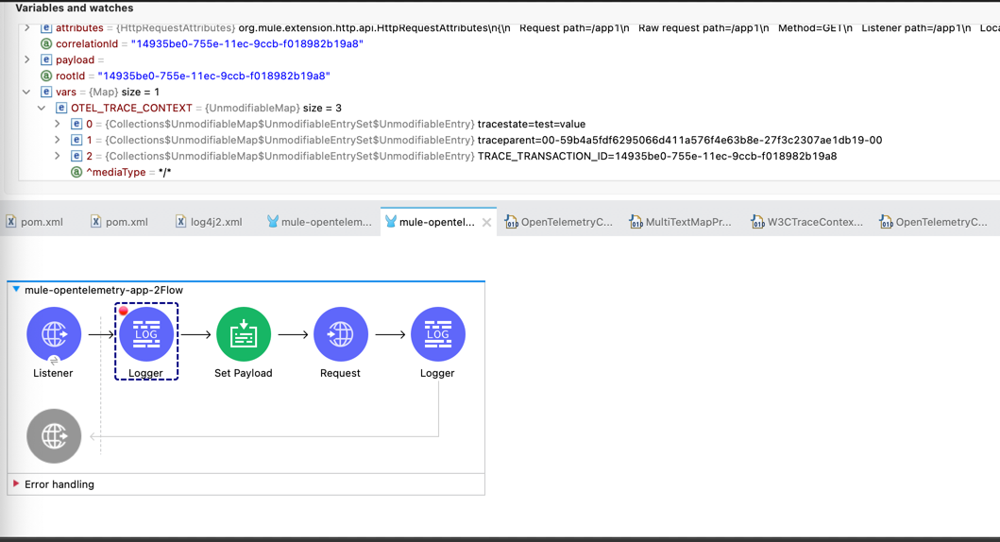

= Mule OpenTelemetry Extension
ifndef::env-github[:icons: font]
ifdef::env-github[]
:caution-caption: :fire:
:important-caption: :exclamation:
:note-caption: :paperclip:
:tip-caption: :bulb:
:warning-caption: :warning:
endif::[]
:toc: macro

toc::[]

== OpenTelemetry

From https://opentelemetry.io[OpenTelemetry.io],

[quote]
OpenTelemetry is a collection of tools, APIs, and SDKs. Use it to instrument, generate, collect, and export telemetry data (metrics, logs, and traces) to help you analyze your software’s performance and behavior.

This *purpose* of this mule extension is to allow Mule Applications participate in OpenTelemetry-based distributed traces.

image::docs/images/mule-with-opentelemetry.png[]

== Usage

To use this extension, add following dependency to your mule application project.

[source,xml]
----
    <dependency>
      <groupId>com.avioconsulting</groupId>
      <artifactId>mule-open-telemetry-module</artifactId>
      <version>${mule-open-telemetry-module-version}</version>
      <classifier>mule-plugin</classifier>
    </dependency>
----

=== Auto Configuration
Extension uses OpenTelemetry's autoconfigured SDK. In this mode, SDK will configure itself based on the environment variables.
Supported environment variable details can be seen on https://github.com/open-telemetry/opentelemetry-java/tree/main/sdk-extensions/autoconfigure[open-telemetry/opentelemetry-java].

=== Extension Configuration
Extension allows to configure some resource and exporter attributes at individual application level. This configuration is minimal required to successfully send traces to OpenTelemetry collector.

Following example shows an OpenTelemetry Config with OTLP Exporter configured -

[source,xml]
----
<opentelemetry:config name="OpenTelemetry_Config" doc:name="OpenTelemetry Config" doc:id="91477cb5-36f7-48ad-90b7-c339af87b408" serviceName="api-app-1">
    <opentelemetry:exporter >
        <opentelemetry:otlp-exporter collectorEndpoint="http://localhost:55681/v1" protocol="HTTP_PROTOBUF" >
            <opentelemetry:headers >
                <opentelemetry:header key="testHeader" value="testHeaderValue" />
            </opentelemetry:headers>
            <opentelemetry:config-properties >
                <opentelemetry:config-property key="otel.logs.exporter" value="otlp" />
            </opentelemetry:config-properties>
        </opentelemetry:otlp-exporter>
    </opentelemetry:exporter>
    <opentelemetry:resource-attributes >
        <opentelemetry:attribute key="mule.env" value="Dev" />
    </opentelemetry:resource-attributes>
</opentelemetry:config>
----

When additional properties from SDK Auto-configuration are needed for exporter, `config-properties` can be used to add those. Environment and System properties will still override those entries.

=== Resources
Extension uses the OpenTelemetry SDK's https://github.com/open-telemetry/opentelemetry-java/tree/main/sdk-extensions/autoconfigure#resource-provider-spi[Resource Provider SPI] to gather data of common resources such as Host, OS, Processes of the Mule runtime Server and host. SDK supported all common resources providers are configured by this module.

.Example Set of tags captured with common resource providers
[source,json]
----
  {
    "host.arch": "x86_64",
    "host.name": "ac0098.local",
    "os.description": "Mac OS X 10.16",
    "os.type": "darwin",
    "process.command_line": "/Applications/AnypointStudio.app/Contents/Eclipse/plugins/org.mule.tooling.jdk.v8.macosx.x86_64_1.1.1/Contents/Home/jre:bin:java -Dmule.home=/Applications/AnypointStudio.app/Contents/....d=1 -Dwrapper.lang.domain=wrapper -Dwrapper.lang.folder=../lang",
    "process.executable.path": "/Applications/AnypointStudio.app/Contents/Eclipse/plugins/org.mule.tooling.jdk.v8.macosx.x86_64_1.1.1/Contents/Home/jre:bin:java",
    "process.pid": "9778",
    "process.runtime.description": "AdoptOpenJDK OpenJDK 64-Bit Server VM 25.282-b08",
    "process.runtime.name": "OpenJDK Runtime Environment",
    "process.runtime.version": "1.8.0_282-b08"
  }
----

See https://github.com/open-telemetry/opentelemetry-java/tree/main/sdk-extensions/autoconfigure#disabling-automatic-resourceproviders[Disabling Common Resource Providers] if any resource provider must be disabled.

=== Exporters

Extension supports following exporter configurations -

- OTLP Exporter
- Logging Exporter
- Generic Exporter

==== OTLP Exporter
Extension contains all dependencies needed to send traces to an OpenTelemetry Collector endpoint i.e. when `otel.traces.exporter` is set to `otlp`. Note that `otlp` is the default exporter if the variable is not set.

==== Logging Exporter
Extension contains all dependencies needed to send traces to a `java.util.Logger` instance i.e. when `otel.traces.exporter` is set to `logging`.

==== Generic Exporter
This generic exporter allows to configure any other exporters supported by https://github.com/open-telemetry/opentelemetry-java/tree/main/sdk-extensions/autoconfigure#exporters[sdk-extensions/autoconfigure#exporters].

WARNING: Required external dependencies must be added to the application.

Following example shows possible configuration for to send traces to Zipkin. This will require Zipkin dependencies to be added to the application.

[source,xml]
----
<opentelemetry:config name="OpenTelemetry_Generic" doc:name="OpenTelemetry Config" serviceName="app1" >
    <opentelemetry:exporter >
        <opentelemetry:generic-exporter >
            <opentelemetry:config-properties >
                <opentelemetry:config-property key="otel.traces.exporter" value="zipkin" />
                <opentelemetry:config-property key="otel.exporter.zipkin.endpoint" value="http://localhost:9411/api/v2/spans" />
            </opentelemetry:config-properties>
        </opentelemetry:generic-exporter>
    </opentelemetry:exporter>
</opentelemetry:config>
----

== Trace Spans
Trace spans are created for only following mule components -

- flows
- http listener and request

NOTE: This can be changed to create spans for every mule processors by setting `spanAllProcessors = "false"` (can be overridden by setting system property `mule.otel.span.processors.enable` to `true|false`).

== Context Propagation

https://www.w3.org/TR/trace-context/#trace-context-http-headers-format[W3C Trace Context] and https://www.w3.org/TR/baggage/#baggage-http-header-format[W3C Baggage Context] are supported for incoming requests.

Source Components supporting context extraction:
- HTTP Listener Flows: Context information is extracted from request headers

NOTE: OpenTelemetry Trace Context is extracted/injected using configured Propagators. The entries in the context may vary depending on the propagators used and validations it applies. All examples here are with *W3C Trace Context*.

=== Context Extraction
Extension supports extracting Open Telemetry Trace context extraction from inbound HTTP Requests.
Based on configured propagator (see above), extension will set attach to any parent span if exists.

=== Context Injection

==== Auto Injection to Flow Variables
Extension uses a processor interceptor. OpenTelemetry's tracing context will be automatically added to a flow variable before the first processor is invoked.
It is always injected under a key **OTEL_TRACE_CONTEXT**.

NOTE: In case interception needs to be disabled, set the system property **"mule.otel.interceptor.processor.enable"** to **"false"**.

Following examples show a **W3C Trace Context** extracted from incoming http request:

image::./docs/images/auto-context-flow-injection.png[]

Another variation when **tracestate** is received with **traceparent**

==== Manual Injection
If needed, `<opentelemetry:get-trace-context />` operation can be used to manually inject trace context into flow.

**NOTE:** `target` must be used to set operation output to a flow variable.

[source,xml]
----
<opentelemetry:get-trace-context doc:name="Get Trace Context" config-ref="OpenTelemetry_Config" target="traceContext"/>
----

image::./docs/images/manual-context-flow-injection.png[]

=== HTTP Request Context Injection
Extension does **NOT** support automatic context propagation. But using the context injection described above, this can be manually be achieved.

When using default W3C Trace Context Propagators, you can add trace headers in default headers section of HTTP Requester configuration.
This will ensure sending context headers for each outbound request.

[source,xml]
----
    <http:request-config name="HTTP_Request_configuration_App2" doc:name="HTTP Request configuration" doc:id="23878620-099a-4c33-8a3a-31cdc4f912d1">
    <http:request-connection host="localhost" port="8082" />
    <http:default-headers >
      <http:default-header key="traceparent" value="#[(vars.OTEL_TRACE_CONTEXT.traceparent as String) default '']" />
    </http:default-headers>
  </http:request-config>
----

As described above in context extraction, if the target endpoint is another mule app with this extension configured, it will be able to extract this context on the listener and attach its own span to it.

== Limitations
- Automatic header/attribute injections for outbound requests is not supported

== Testing

=== Local Collector with Zipkin

`src/test/docker` contains two files:

- docker-compose.yml: This config file configures two services -
- OpenTelemetry Collector: https://opentelemetry.io/docs/collector/getting-started/#docker[Collector] service to receive traces.
- OpenZipkin: https://zipkin.io/[Zipkin] as a tracing backend.
- otel-local-config.yml: Collector configuration file. Collector service uses this and forwards traces to zipkin.

=== Local configuration
Following environment variables must be set to send traces to OpenTelemetry collector -

[source,properties]
----
otel.traces.exporter=otlp
otel.exporter.otlp.endpoint=http://localhost:55681/v1
otel.exporter.otlp.traces.endpoint=http://localhost:55681/v1/traces
otel.exporter.otlp.protocol=http/protobuf
otel.metrics.exporter=none
otel.resource.attributes=deployment.environment=dev,service.name=test-api
----

=== Running Example Mule Apps

Import applications from `./examples` directory into Anypoint Studio. Both applications have an OpenTelemetry Configuration to send traces to local docker collector.

Application 1 exposes `http://localhost:8081/app1/{userId}` endpoint for invocation. App 1 calls App 2 over http to simulate distributed tracing.

Anypoint studio caches' the modules used. If you need to modify the extension and test it in imported applications, you need to bump up the version and update example projects with new version.

You may use following command to keep incrementing patch version and install locally -
[source,bash]
----
mvn build-helper:parse-version versions:set -DnewVersion='${parsedVersion.majorVersion}.${parsedVersion.minorVersion}.${parsedVersion.nextIncrementalVersion}' versions:commit && mvn spotless:apply install
----

== TODO
- Extension Features
  - OpenTelemetry SDK
    - [ ] Create Mule Environment https://github.com/open-telemetry/opentelemetry-java/tree/main/sdk-extensions/autoconfigure#resource-provider-spi[Resource]
  - [x] Mule SDK Based OpenTelemetry Connection Management
  - Configuration
    - [x] Allow setting service name on configuration
    - [x] Allow configuring OpenTelemetry Collector endpoint in configuration. System variables should override this configuration.
    - [x] Allow disabling the interceptor processing if needed. This will result in loosing context injection in flow variables.
  - Operations
    - [x] Add an operation to retrieve current trace context. SDK does not allow adding variables. Users may have to use `targetVariable` feature.
    - [ ] If possible, add a DW function to retrieve trace context as a Map. Users can add this map to any existing outbound headers.
  - Scopes
    - [ ] Add a custom scope container to execute components in a span.
  - Outbound
    - [ ] Auto-inject trace context in outbound requests.
