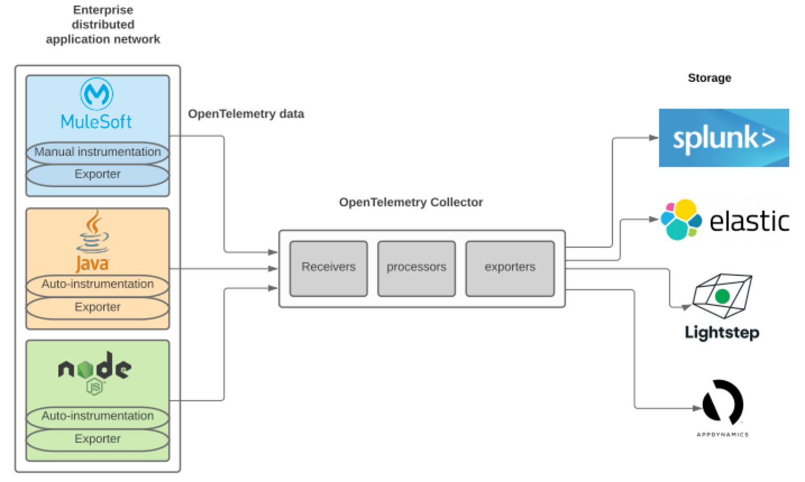

= Mule 4 OpenTelemetry Extension
ifndef::env-github[:icons: font]
ifdef::env-github[]
:caution-caption: :fire:
:important-caption: :exclamation:
:note-caption: :paperclip:
:tip-caption: :bulb:
:warning-caption: :warning:
endif::[]
:toc: macro

toc::[]

== OpenTelemetry

From https://opentelemetry.io[OpenTelemetry.io],

[quote]
OpenTelemetry is a collection of tools, APIs, and SDKs. Use it to instrument, generate, collect, and export telemetry data (metrics, logs, and traces) to help you analyze your software’s performance and behavior.

This *purpose* of this mule extension is to allow Mule Applications participate in OpenTelemetry-based distributed traces.

== Documentation

* https://avioconsulting.github.io/mule-opentelemetry-module/[HTML Documentation] User reference
** Jump to https://avioconsulting.github.io/mule-opentelemetry-module/#The-How-Mule-OTel-module-id[Installation and Usage section]
* Instructions for link:CONTRIBUTING.adoc[Contributing] to the repo.

NOTE: This module supports OpenTelemetry *Traces* only. Metrics and Logs are _not_ supported, yet. See https://github.com/avioconsulting/mule-opentelemetry-module/issues/38[Issue#38].
