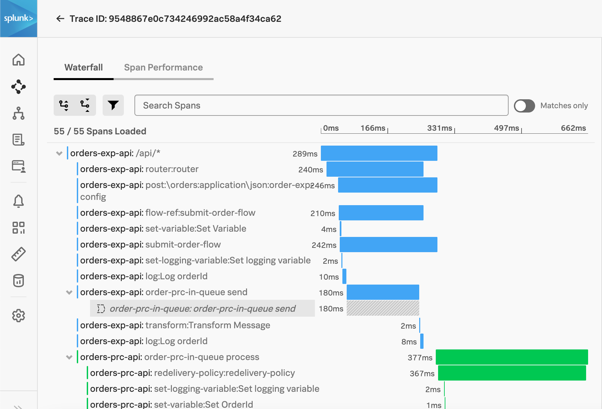
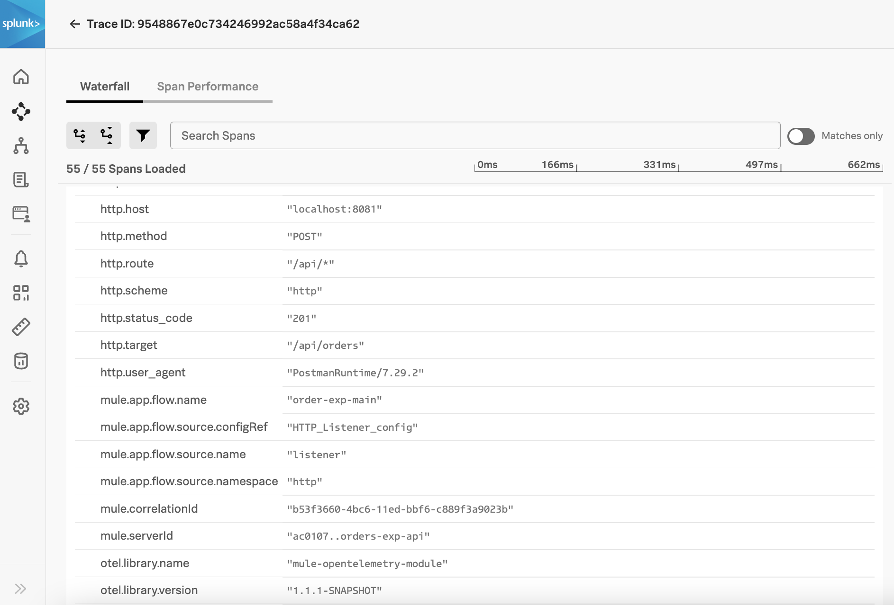

=== APM - Splunk Observability Cloud

Splunk APM is one of the product in Splunk Observability Cloud. It is for Instrumenting custom-built applications, serverless functions, and custom-instrumentation data for server side applications.

==== Configuration

Splunk provides the https://docs.splunk.com/Observability/gdi/opentelemetry/install-the-collector.html#otel-install-platform[Splunk Distribution of OpenTelemetry collector,role=external,window=_blank] to send OpenTelemetry based trace data to APM.

Once you have the collector installed and configured, you can use the module's <<OTLP-Exporter,OTLP Exporter>> to send trace data to Splunk Observability Cloud.

[source, xml]
.Example Config for Splunk Observability
----
	<opentelemetry:config name="OpenTelemetry_Config"
		serviceName="${domain}"
        spanAllProcessors="true">
		<opentelemetry:resource-attributes>
			<opentelemetry:attribute key="mule.env"
				value="${mule.env}" />
			<opentelemetry:attribute
				key="deployment.environment" value="${mule.env}" />     // <1>
		</opentelemetry:resource-attributes>
		<opentelemetry:exporter>  //<2>
			<opentelemetry:otlp-exporter
				collectorEndpoint="${otel.collector.endpoint}">     //<3>
			</opentelemetry:otlp-exporter>
		</opentelemetry:exporter>
	</opentelemetry:config>
----

<1> Add `deployment.environment` resource attribute to enable Service Dependency maps.
<2> Use OTLP Exporter configuration to export traces to Splunk
<3> Configure OTLP Endpoint URL (eg. http://localhost:4317) to receive traces.

==== Trace Examples

Here is how a trace would look in Splunk APM -

NOTE: Splunk generates Inferred Services based on span attributes. You may need to set additional tags to correctly represent the services. See adding Global Config Span tags.

Trace attributes are available when you expand individual span.

