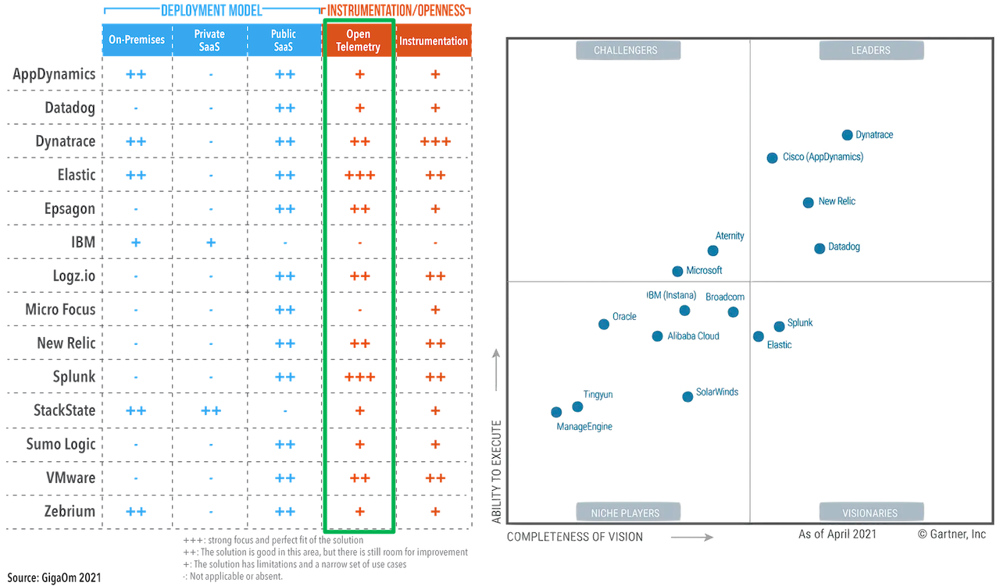
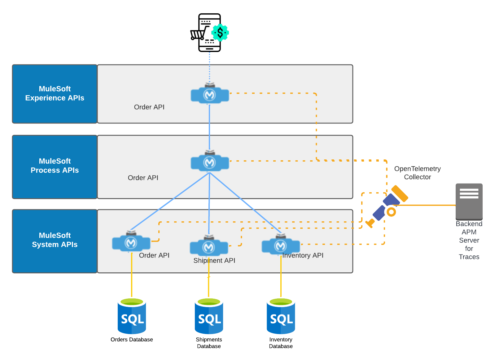

== APM Support Testing

OpenTelemetry provides a *vendor-agnostic* implementation that
can be configured to send telemetry data to the backend(s) a.k.a APM(s) of your choice.

As shown in the graphic below, a *2021 GigaOm* study concluded that top tier cloud providers are moving to embrace OpenTelemetry quickly
and observability vendors are likewise offering integration with OpenTelemetry tools, albeit, at various levels.

The mule-opentelemetry-module can thus export traces to any APM that is OpenTelemetry compatible or has a collector to facilitate opentelemetry formatted data collection.

Following sections will explore the configurations, support and usage of this module for various APMs.

=== Demo Scenario

For verifying the support of APMs, we will use an Online Order use case. Following API-led diagram shows the different APIs involved in our demo.

include::./elastic.adoc[Elastic]

include::./dynatrace.adoc[Dynatrace]

=== APM Test Matrix

Below is a list of the various backends the extension has been tested with so far:

.Tested Backends
[cols="45%, 25%, 30%"]
|===
| *Backend*                                             | *Export Protocol*    | *Note*
| Dynatrace                                             | OTLP/HTTP_PROTOBUF   |
| Grafana Labs Tempo                                    | OTLP/HTTP_PROTOBUF   |
| ELK Stack v7.14.2 (Elasticsearch, Kibana, APM Server) | OTLP/gRPC            | HTTP_PROTOBUF currently not supported by Elastic
|===
