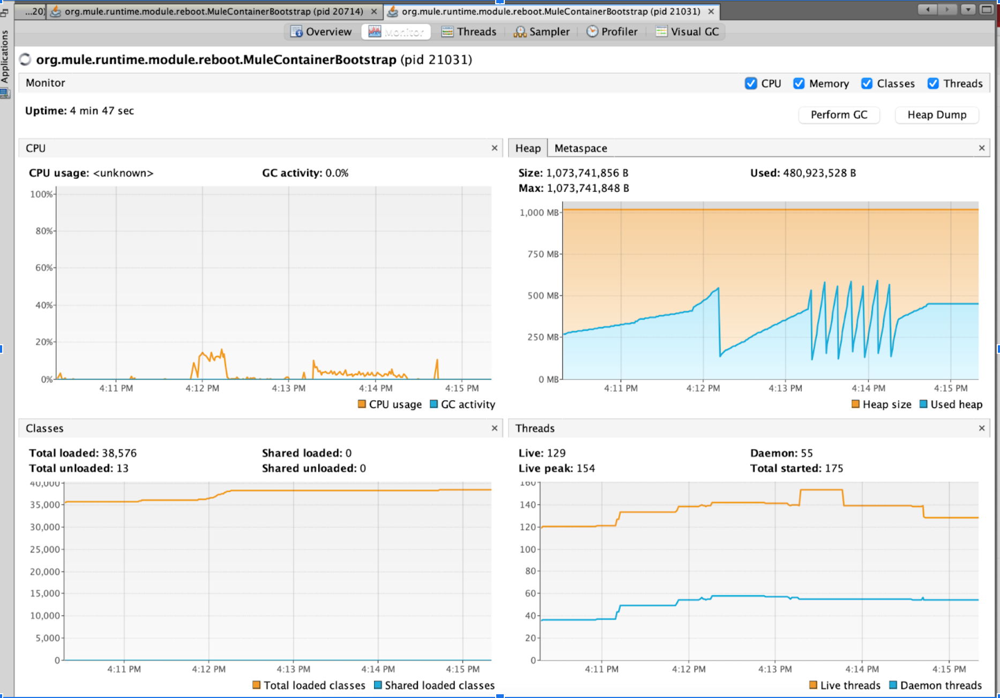
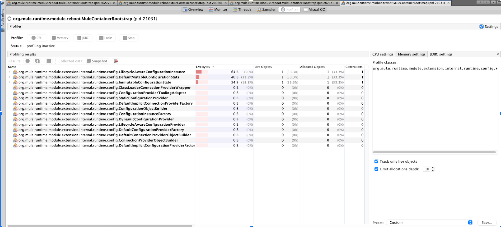
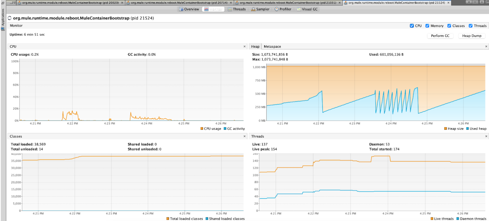
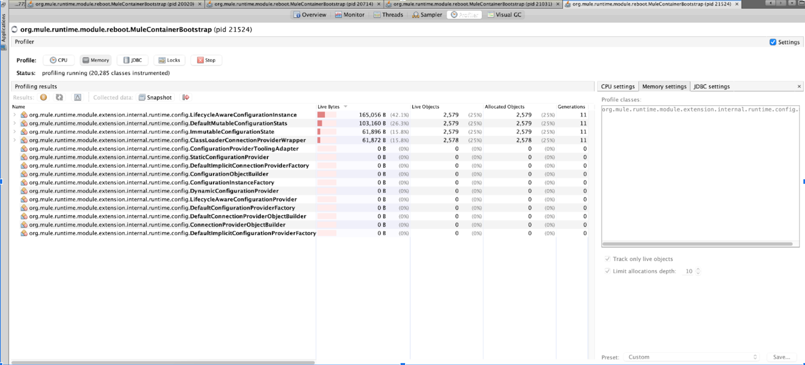

== Performance Report

The use of `mule-opentelemetry-module` can add some overhead to the application performance. The following sections describe the activities performed to understand this overhead.

=== Application Architecture

To execute the performance test, we use an Order Process API that is configured to use this module and send telemetry data to elastic cloud.

In this scenario, the Order Process API integrates with 3 other system APIS - Order System API, Shipments System API, and Notifications System API.

image::Order APILed with OpenTelemetry.png[900, 900, title="Order API-led Architecture", align="center"]

To understand the application at flow level, below image shows how the flows are set up for using various types of connectors, processors, and other modules available in Mule.

image::perf-test-app-flows.png[title="Order Process API Flow Structure", align="center"]

image::mule-flow-diagram-order-process-api.png[title="Mule Flows - Graph Diagram", align="center"]

=== Deployment Strategy

The application is deployed to the CloudHub with following setup -

* CloudHub as a deployment target
* Single 1 vCore Worker
* Mule Runtime Version 4.4.0 09-06-2022

=== Test Setup

To simulate real world scenarios, the system APIs are configured using the mocks to delay responses by predefined times. Following were the test parameters -

* Deployed two instances of the test Application - One with the OpenTelemetry module and one without OpenTelemetry module
* Module configured to generate spans for all processors
* Workload of 100 concurrent requests for 15 minutes
* Intentional delayed response from System APIs as below
** Order System API 200 milliseconds
** Shipment System API 500 milliseconds
** Notification System API 100 milliseconds

=== Observations

After multiple iterations of the test with above setup and comparing the performance of both applications (with and without OpenTelemetry module), it is observed that _using OpenTelemetry module_ had the following impacts on the application performance -

* Up to 5% overhead on request processing under the load
* Up to 10% CPU overhead

[#_static_vs_dynamic_global_configurations]
==== Static vs. Dynamic Configurations

Depending on how global configurations are written they can be https://docs.mulesoft.com/mule-sdk/latest/static-dynamic-configs[Static or Dynamic].

- *Static Configuration* - A configuration is static when none of its parameters are assigned an expression (even if those parameters do support expressions)

[source,xml]
----
<http:request-config name="HTTP_Request_configuration" doc:name="HTTP Request configuration">
    <http:request-connection host="${sys.greet.http.host}" port="${sys.greet.http.port}" />
</http:request-config>
----

- *Dynamic Configuration* - In dynamic configurations, at least one parameter has an expression

[source,xml]
----
<http:request-config name="HTTP_Request_configuration" doc:name="HTTP Request configuration">
  <http:request-connection host="${sys.greet.http.host}" port="${sys.greet.http.port}"
    <http:default-headers>
      <http:default-header key="traceparent"
value="#[vars.OTEL_TRACE_CONTEXT.traceparent as String]" />
    </http:default-headers>
</http:request-config>
----

_For Static configurations_, a single instance is created and _re-used_ each time it is needed.

_For Dynamic configurations_, Each time an operation that points to a dynamic configuration is executed, all the parameters in the configuration are evaluated. A configuration instance is created for each unique set of resolved parameters. In that way, each time the same values are resolved, the same instance is returned, but for each different set of values, a _different_ instance is created.

This lifecycle difference can make a huge difference on the configuration objects created. Every request will have a different `traceparent` value. Thus, when using Dynamic configurations, a new instance will be created *for each request*.

Following result demonstrates the configuration Object creations for a load of _20 concurrent users for a 1-minute_ time period -

*Observations:*

- The number of Objects creation and allocation is much higher for Dynamic configurations
- With configuration expiration window, this affects the memory consumption and GC times

*Recommendations:*

For higher load applications, static configurations i.e. propagation from operations instead of global configuration should be preferred.

*Static Configuration Object Creations*

*Dynamic Configuration Object Creations*

